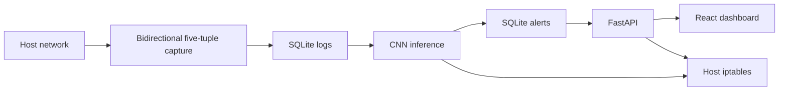

# Architecture

## Data path

The packet capture service groups TCP and UDP packets by protocol and endpoint pair, joins reverse traffic into the same flow, and calculates the ordered 76-feature contract in `ids_core/features.py`. SQLite uses WAL mode and is shared by capture, inference, and API.

Inference atomically commits alerts and its last processed log ID. Each alert has a unique source log ID, providing a second layer of replay protection. Runtime whitelist and block lists are refreshed each poll.

The API and inference containers use host networking plus `NET_ADMIN`; packet capture additionally uses `NET_RAW`. This is required for host firewall enforcement and capture on a Linux IDS VM.

## Trust boundary

Port 8000 exposes management operations without authentication by explicit project choice. Restrict it using VM/network firewall rules. The model and SQLite volume are trusted local assets.
